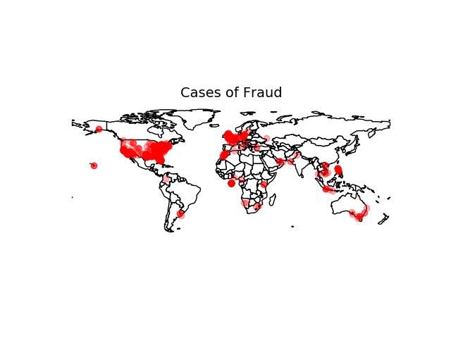
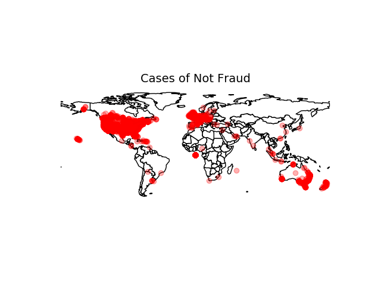
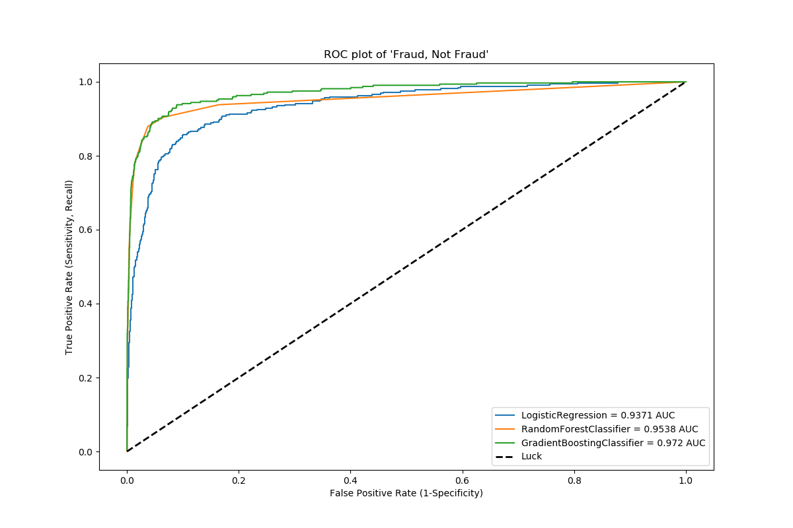
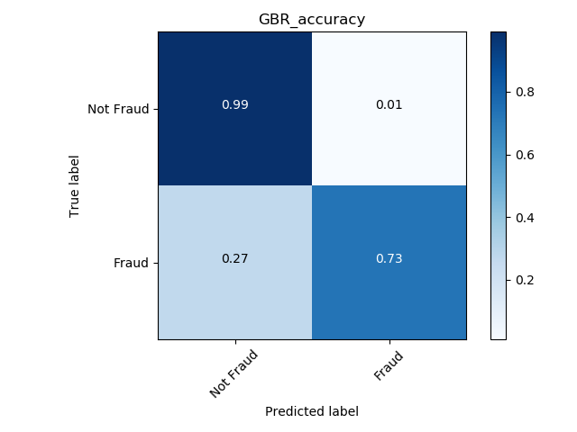
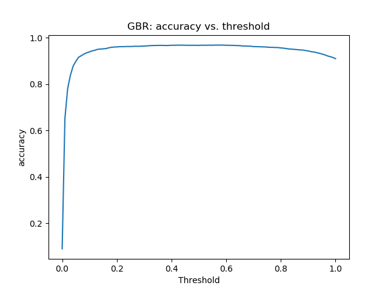

# Fraud detection case study

# Goal
Create a dashboard for investigators which will help them identify new events that are 'red flags' of potential fraud. The application regularly pulls new data from an API, and updates to a display for easy viewing.

# Strategy
- Day 1 - Split into two groups: Modeling group and Data cleaning group on.
- Day 2 - Split into groups: Create flash app and creating PostgreSQL database.

# Data
- Quickly generated skeleton dataframe for modeling team to use.
- We checked for missing values and filled binary features with the majority class, and others with KNN
- Created more robust dataframe with dummy variables and filled NaNs.
- Noticed that a significant portion of longitude/latitude data were missing. Found this to be indicative of fraudulent users attempting to hide their location.
- Created a column "has_location" and encoded it with 1 for has location and 0 for doesn't have location.
- Columns: 'body_length', 'delivery_method', 'fb_published', 'has_analytics', 'has_header', 'has_logo', 'listed', 'name_length', 'num_payouts', 'org_facebook', 'org_twitter', 'sale_duration', 'show_map', 'user_age', 'user_type', 'venue_latitude', 'venue_longitude', 'fraud', 'has_location', 'AUD', 'CAD', 'EUR', 'GBP', 'MXN', 'NZD', 'ACH'

# Where is the Fraud?

Cases of Fraud, where there are no cases of Not Fraud:
- Philippines
- Northern India
- Eastern Ukraine

Cases of Not Fraud, where there are no cases of Fraud:
- New Zealand
- Western Australia

# Model
Only used numeric values from dataframe for the model.

After comparing logistic regression, random forest classifier, and gradient boosting classifier, we saw gradient boosting had the largest area under the curve

| **TN**       | **FP**           |
| ------------- |:-------------:|
| **FN**     | **TP** |

| Model         |   Accuracy |  Recall |
| ------------- |:-------------:|:-------------:|
| LogReg        |   0.943    |  0.517
| Rand Forest   |   0.968    |  0.777
| GBR           |   0.968    |  0.774

Optimize for recall because we would rather have more false positive (calling an observation spam when it is not spam) than false negatives (calling an observation not spam when it is spam).

<!--  -->

Upsampling did not seem to improve scores.  When the model was pushed up to AWS, there were some technical difficulties.

# Pipeline

### Fetch Data from API
- Python

### Run Data through Model
- Python

### Output Results from Model to Database
- PostgresQL receives a dictionary
- {object_id: int, fraud: string, probability of fraud: float}
- Iteratively updating and receiving data from model. Model sleeps every 5 minutes for the next API call.

### Call Results from Database to Flask App

# Conclusions

- Feature engineering is a touchy subject.  Not sure how the model may change by adding or taking out certain features.

- Would have liked to use NLP to analyze the description of the observations, but with the allotted time, we skipped it.

PostgreSQL, Fancy Imputer, GeoPandas, sklearn
